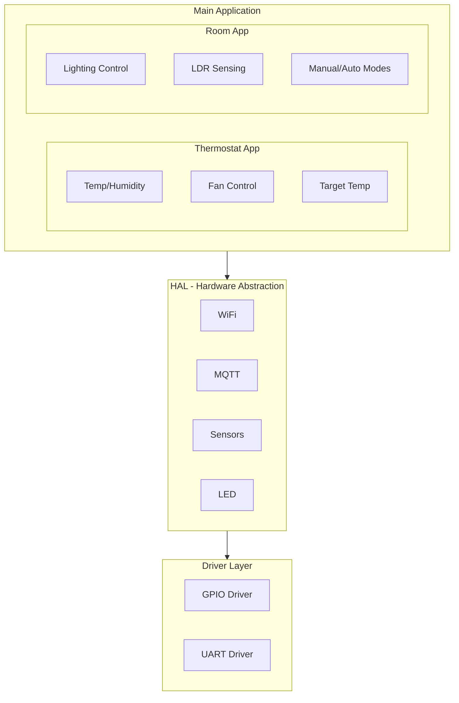

# ESP32 Smart Room Firmware


> Production-ready firmware for ESP32-based smart hotel room sensors and actuators with real-time MQTT communication and FreeRTOS task management.

## Table of Contents

- [Overview](#overview)
- [Features](#features)
- [Hardware Requirements](#hardware-requirements)
- [Architecture](#architecture)
- [Quick Start](#quick-start)
- [Configuration](#configuration)
- [MQTT Topics](#mqtt-topics)
- [Project Structure](#project-structure)
- [Development](#development)
- [Troubleshooting](#troubleshooting)

## Overview

This firmware transforms an ESP32 microcontroller into a smart room controller that monitors environmental conditions and controls room equipment. It communicates with the Smart Hotel cloud infrastructure via MQTT, enabling real-time monitoring and remote control through the dashboard.

### What It Does

| Function | Description |
|----------|-------------|
| **Temperature Monitoring** | DHT22 sensor for precise temperature readings |
| **Humidity Tracking** | Real-time humidity percentage monitoring |
| **Light Sensing** | LDR-based ambient light level detection |
| **Gas Detection** | MQ-5 sensor for combustible gas monitoring |
| **Climate Control** | Thermostat logic with heating/cooling control |
| **Lighting Control** | LED dimming based on ambient light or manual control |
| **Remote Commands** | MQTT-based control from cloud dashboard |

## Features

### Real-Time Operating System (FreeRTOS)

The firmware uses FreeRTOS for reliable multitasking:

- **Task Isolation**: Each subsystem runs in its own task
- **Priority Scheduling**: Critical tasks get CPU time first
- **Queue-Based Communication**: Thread-safe data passing between tasks
- **Mutex Protection**: Safe access to shared resources
- **Event Groups**: Efficient inter-task synchronization

### Modular Architecture



### Automatic Reconnection

- WiFi auto-reconnect with configurable interval
- MQTT broker reconnection with exponential backoff
- Graceful handling of network interruptions
- State preservation during disconnections

## Hardware Requirements

### Core Components

| Component | Model | Purpose |
|-----------|-------|---------|
| **Microcontroller** | ESP32-DevKit-V1 | Main processing unit |
| **Temperature/Humidity** | DHT22 | Climate monitoring |
| **Light Sensor** | LDR (photoresistor) | Ambient light detection |
| **Gas Sensor** | MQ-5 | Combustible gas detection |
| **LEDs** | Standard 5mm | Status and room lighting |

### Pin Configuration

```
ESP32 Pin Assignments
═══════════════════════════════════════════════════════════

Sensors:
  GPIO 14  ─────── DHT22 Data Pin
  GPIO 35  ─────── LDR (Analog Input)
  GPIO 33  ─────── MQ-5 Gas Sensor (Analog Input)

Outputs:
  GPIO 2   ─────── LED 1 (Status/Room Light)
  GPIO 5   ─────── LED 2 (Secondary Light)
  GPIO 32  ─────── LED 3 (Indicator)

Communication:
  GPIO 16  ─────── UART RX (Optional)
  GPIO 17  ─────── UART TX (Optional)

Power:
  3.3V     ─────── Sensor Power (DHT22, LDR)
  5V       ─────── MQ-5 Heater Power
  GND      ─────── Common Ground
```

### Wiring Diagram

```mermaid
flowchart LR
    subgraph INPUTS[\"Input Devices\"]
        DHT22[\"DHT22\"]
        LDR[\"LDR\"]
        MQ5[\"MQ-5\"]
    end
    
    subgraph ESP[\"ESP32-DevKit\"]
        direction TB
        GPIO14[\"GPIO14\"]
        GPIO35[\"GPIO35 ADC\"]
        GPIO33[\"GPIO33 ADC\"]
        GPIO2[\"GPIO2\"]
        GPIO5[\"GPIO5\"]
        GPIO32[\"GPIO32\"]
    end
    
    subgraph OUTPUTS[\"Output Devices\"]
        LED1[\"LED1\"]
        LED2[\"LED2\"]
        LED3[\"LED3\"]
    end
    
    DHT22 --> GPIO14
    LDR --> GPIO35
    MQ5 --> GPIO33
    GPIO2 --> LED1
    GPIO5 --> LED2
    GPIO32 --> LED3
```

## Architecture

### Application Layer

#### Thermostat Application (`app/thermostat/`)

Manages climate control with the following RTOS tasks:

| Task | Priority | Stack | Function |
|------|----------|-------|----------|
| `TempSensorTask` | Medium | 4KB | Read DHT22, calculate averages |
| `UserInputTask` | Medium | 2KB | Process potentiometer/MQTT input |
| `FanControlTask` | High | 2KB | PWM output for heating/cooling |
| `MQTTPublishTask` | Low | 4KB | Publish sensor data to broker |

**Features:**
- Target temperature setting via MQTT
- Deadband control to prevent oscillation
- Fan speed control (off/low/medium/high)
- Humidity monitoring and reporting

#### Room Application (`app/room/`)

Controls lighting and monitors ambient conditions:

| Task | Priority | Stack | Function |
|------|----------|-------|----------|
| `SensorTask` | Medium | 2KB | Read LDR, update light levels |
| `ControlTask` | Medium | 2KB | Process control commands |
| `ButtonTask` | High | 4KB | Handle physical button input |

**Operating Modes:**
- **AUTO**: LEDs adjust based on ambient light
- **MANUAL**: Direct control via MQTT commands
- **OFF**: All room lights disabled

### HAL Layer

Hardware abstraction for portable, testable code:

| Module | Files | Purpose |
|--------|-------|---------|
| `hal_wifi` | WiFi management | Connection, reconnection, status |
| `hal_mqtt` | MQTT client | Publish, subscribe, callbacks |
| `hal_dht` | DHT22 driver | Temperature/humidity reading |
| `hal_ldr` | LDR driver | Light level measurement |
| `hal_mq5` | MQ-5 driver | Gas concentration reading |
| `hal_led` | LED control | On/off and PWM dimming |
| `hal_pwm` | PWM output | Fan speed, LED brightness |

### Driver Layer

Low-level hardware access:

- **GPIO Driver**: Pin configuration, read/write
- **UART Driver**: Serial communication (debugging, external devices)

## Quick Start

### Prerequisites

- [PlatformIO](https://platformio.org/) IDE or CLI
- USB cable for ESP32 programming
- WiFi network with MQTT broker access

### Build and Flash

```bash
# Clone the repository
git clone https://github.com/yourusername/smart-hotel.git
cd smart-hotel/esp32

# Configure WiFi and MQTT (edit src/app_cfg.h)
nano src/app_cfg.h

# Build the firmware
pio run

# Upload to ESP32
pio run --target upload

# Monitor serial output
pio device monitor
```

### First Boot Output

```
=== Smart Room System ===
Initializing...
WiFi initialization started
[WiFi] Connecting to: YourNetwork
[WiFi] Connected! IP: 192.168.1.100
[MQTT] Connecting to broker...
[MQTT] Connected to mqtt.example.com:1883
[Thermostat] Task initialized
[Room] RTOS Initialized
System ready!
```

## Configuration

All configuration is centralized in `src/app_cfg.h`:

### Module Enables

```cpp
// Enable/disable hardware modules
#define DHT22_ENABLED       STD_ON
#define LDR_1_ENABLED       STD_ON
#define MQ5_1_ENABLED       STD_ON
#define LED_ENABLED         STD_ON
#define WIFI_ENABLED        STD_ON
#define MQTT_ENABLED        STD_ON
```

### Network Configuration

```cpp
// WiFi credentials
#define WIFI_SSID           "YourNetworkName"
#define WIFI_PASSWORD       "YourPassword"

// MQTT broker settings
#define MQTT_BROKER         "mqtt.yourdomain.com"
#define MQTT_PORT           1883
#define MQTT_RECONNECT_MS   5000
```

### Sensor Pins

```cpp
// Sensor GPIO assignments
#define DHT22_PIN           14
#define LDR_PIN             35
#define MQ5_PIN             33

// LED GPIO assignments
#define LED_1_PIN           2
#define LED_2_PIN           5
#define LED_3_PIN           32
```

### Thermostat Parameters

```cpp
// Temperature range
#define TEMP_MIN            15.0f
#define TEMP_MAX            35.0f

// Humidity range
#define HUMIDITY_MIN        20.0f
#define HUMIDITY_MAX        90.0f

// Control parameters
#define THERMOSTAT_UPDATE_RATE_MS   1000
#define THERMOSTAT_PUBLISH_RATE_MS  5000
#define THERMOSTAT_TEMP_DEADBAND    0.5f
```

### Debug Options

```cpp
// Enable debug output per module
#define DHT22_DEBUG         STD_ON
#define WIFI_DEBUG          STD_ON
#define MQTT_DEBUG          STD_ON
#define LDR_1_DEBUG         STD_ON
#define MQ5_1_DEBUG         STD_ON
```

## MQTT Topics

### Telemetry (Device → Cloud)

Published automatically at configured intervals:

| Topic | Payload | Description |
|-------|---------|-------------|
| `hotel/{room}/telemetry/temperature` | `23.5` | Temperature in °C |
| `hotel/{room}/telemetry/humidity` | `45.2` | Humidity percentage |
| `hotel/{room}/telemetry/luminosity` | `78` | Light level (0-100%) |
| `hotel/{room}/telemetry/gas` | `12` | Gas level (0-255) |
| `hotel/{room}/telemetry/heating` | `ON`/`OFF` | Heating status |
| `hotel/{room}/telemetry/fan_speed` | `LOW`/`MED`/`HIGH` | Fan speed |

### Control (Cloud → Device)

Subscribe to receive commands:

| Topic | Payload | Description |
|-------|---------|-------------|
| `hotel/{room}/control/target_temp` | `22.0` | Set target temperature |
| `hotel/{room}/control/fan_speed` | `0-3` | Set fan speed level |
| `hotel/{room}/control/mode` | `AUTO`/`MANUAL`/`OFF` | Set operating mode |
| `hotel/{room}/control/led1` | `ON`/`OFF` | Control LED 1 |
| `hotel/{room}/control/led2` | `ON`/`OFF` | Control LED 2 |

### Legacy Topics (Backward Compatibility)

```cpp
// Home automation format
#define MQTT_TOPIC_TEMP         "home/thermostat/temperature"
#define MQTT_TOPIC_HUMIDITY     "home/thermostat/humidity"
#define MQTT_TOPIC_TARGET       "home/thermostat/target"
#define MQTT_TOPIC_HEATING      "home/thermostat/heating"
```

## Project Structure

```
esp32/
├── platformio.ini              # PlatformIO configuration
├── README.md                   # This file
├── .gitignore                  # Git ignore rules
│
└── src/
    ├── main.cpp                # Application entry point
    ├── app_cfg.h               # Centralized configuration
    │
    ├── app/                    # Application layer
    │   ├── thermostat/         # Climate control application
    │   │   ├── thermostat_rtos.cpp/.h      # RTOS tasks
    │   │   ├── thermostat_fan_control.cpp/.h
    │   │   ├── thermostat_config.h
    │   │   └── thermostat_types.h
    │   │
    │   └── room/               # Room control application
    │       ├── room_rtos.cpp/.h            # RTOS tasks
    │       ├── room_logic.cpp/.h           # Control logic
    │       ├── room_config.h
    │       └── room_types.h
    │
    ├── hal/                    # Hardware Abstraction Layer
    │   ├── communication/
    │   │   ├── hal_wifi/       # WiFi management
    │   │   └── hal_mqtt/       # MQTT client
    │   │
    │   ├── sensors/
    │   │   ├── hal_dht/        # DHT22 temperature/humidity
    │   │   ├── hal_ldr/        # Light dependent resistor
    │   │   ├── hal_mq5/        # Gas sensor
    │   │   ├── hal_potentiometer/
    │   │   └── SensorH/        # Generic sensor handler
    │   │
    │   ├── hal_led/            # LED control
    │   └── hal_pwm/            # PWM output
    │
    └── drivers/                # Low-level drivers
        ├── driver_gpio/        # GPIO operations
        └── driver_uart/        # UART communication
```

## Development

### Building for Development

```bash
# Build with debug symbols
pio run -e esp32doit-devkit-v1

# Build and upload
pio run --target upload

# Clean build
pio run --target clean
```

### Serial Debugging

```bash
# Start serial monitor
pio device monitor --baud 9600

# Monitor with timestamp
pio device monitor --baud 9600 --filter time
```

### Adding New Sensors

1. Create HAL module in `src/hal/sensors/hal_newsensor/`
2. Add configuration in `app_cfg.h`
3. Initialize in appropriate application task
4. Add MQTT topic for data publishing

### Memory Optimization

The firmware includes stack monitoring:

```cpp
// Enable in app_cfg.h
#define DEBUG_STACK_MONITOR    1

// Output shows stack usage per task
[STACK] TempSensor: 1024 bytes free (min: 892)
[STACK] FanControl: 512 bytes free (min: 456)
```

## Troubleshooting

### WiFi Connection Issues

```
[WiFi] Connection failed
```

**Solutions:**
- Verify SSID and password in `app_cfg.h`
- Check WiFi signal strength
- Ensure 2.4GHz network (ESP32 doesn't support 5GHz)
- Try increasing `reconnect_interval_ms`

### MQTT Connection Fails

```
[MQTT] Connection failed, rc=-2
```

**Error codes:**
| Code | Meaning | Solution |
|------|---------|----------|
| -1 | Connection timeout | Check broker address |
| -2 | Connection refused | Verify port and credentials |
| -3 | Network unavailable | Check WiFi connection |
| -4 | Bad protocol | Update PubSubClient library |

### Sensor Reading Issues

**DHT22 returns NaN:**
- Check wiring (data pin, power, ground)
- Add 10kΩ pull-up resistor
- Increase read interval (minimum 2 seconds)

**LDR always reads 0 or 4095:**
- Verify voltage divider circuit
- Check ADC pin assignment
- Test with known light levels

**MQ-5 unstable readings:**
- Allow 24-48 hour burn-in period
- Ensure proper ventilation
- Check heater voltage (5V required)

### Memory Issues

```
Guru Meditation Error: Core 0 panic'ed (LoadProhibited)
```

**Solutions:**
- Increase task stack size in configuration
- Reduce MQTT queue size
- Enable stack monitoring to identify culprit task
- Check for buffer overflows in string operations

---

**Built for reliability in 24/7 hotel environments.**
